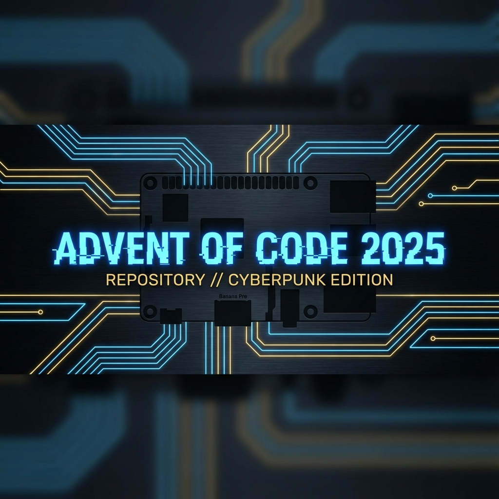

# 🎄 Advent of Code




Welcome to my **Advent of Code** solutions repository!

This project maps my journey through the annual programming puzzles, focusing on **readability**, **clean algorithms**, and exploring language features in **Python** and **Rust**.

## 📖 Table of Contents
- [Quick Start](#-quick-start)
- [2025 Progress](#-2025-progress)
- [Past Years](#-past-years)
- [License](#-license)

## ⚡ Quick Start

For detailed setup instructions, please see [SETUP.md](SETUP.md).

**To check your environment:**
```bash
python check.py
```

---

## 🚀 2025 Progress

**Language**: Rust 🦀 & Python 🐍  
**Goal**: Optimized, idiomatic solutions.

| Day | Puzzle Name | Python | Rust |
| :-: | :--- | :-: | :-: |
| 01 | [Secret Entrance](https://adventofcode.com/2025/day/1) | [🐍 Solution](2025/days/day01/solution.py) <br> P1: 500µs<br> P2: 1.00ms | [🦀 Solution](2025/days/day01/src/lib.rs) <br> P1: 43µs<br> P2: 48µs |
| 02 | [Gift Shop](https://adventofcode.com/2025/day/2) | [🐍 Solution](2025/days/day02/solution.py) <br> P1: 266.92ms<br> P2: 767.75ms<br> P3: 472.12ms | [🦀 Solution](2025/days/day02/src/lib.rs) <br> P1: 47.63ms<br> P2: 75.92ms |
| 03 | [Lobby](https://adventofcode.com/2025/day/3) | [🐍 Solution](2025/days/day03/solution.py) <br> P1: 2.53ms<br> P2: 1000µs | [🦀 Solution](2025/days/day03/src/lib.rs) <br> P1: 81µs<br> P2: 119µs |
| 04 | [Printing Department](https://adventofcode.com/2025/day/4) | [🐍 Solution](2025/days/day04/solution.py) <br> P1: 14.92ms<br> P2: 402.82ms | [🦀 Solution](2025/days/day04/src/lib.rs) <br> P1: 2.31ms<br> P2: 28.25ms |
| 05 | [Cafeteria](https://adventofcode.com/2025/day/5) | [🐍 Solution](2025/days/day05/solution.py) <br> P1: 612µs<br> P2: 103µs | [🦀 Solution](2025/days/day05/src/lib.rs) <br> P1: 59µs<br> P2: 33µs |
| 06 | [Trash Compactor](https://adventofcode.com/2025/day/6) | [🐍 Solution](2025/days/day06/solution.py) <br> P1: 654µs<br> P2: 1.00ms | [🦀 Solution](2025/days/day06/src/lib.rs) <br> P1: 55µs<br> P2: 121µs |
| 07 | [Laboratories](https://adventofcode.com/2025/day/7) | [🐍 Solution](2025/days/day07/solution.py) <br> P1: 943µs<br> P2: 1.47ms | [🦀 Solution](2025/days/day07/src/lib.rs) <br> P1: 36µs<br> P2: 36µs |
| 08 | [Playground](https://adventofcode.com/2025/day/8) | [🐍 Solution](2025/days/day08/solution.py) <br> P1: 140.90ms<br> P2: 147.22ms | [🦀 Solution](2025/days/day08/src/lib.rs) <br> P1: 17.59ms<br> P2: 21.12ms |
| 09 | [Movie Theater](https://adventofcode.com/2025/day/9) | [🐍 Solution](2025/days/day09/solution.py) <br> P1: ⚡ 13.08ms<br> P2: ⚡ 1.18s<br> P3: ⚡ 249.22ms | [🦀 Solution](2025/days/day09/src/lib.rs) <br> P1: ⚡ 91µs<br> P2: ⚡ 3.91ms |
| 10 | [Factory](https://adventofcode.com/2025/day/10) | [🐍 Solution](2025/days/day10/solution.py) <br> P1: ⚡ 11.64ms<br> P2: ⚡ 103.18ms | [🦀 Solution](2025/days/day10/src/lib.rs) <br> P1: ⚡ 19µs<br> P2: ⚡ 19µs |


## 🗂️ Past Years

I've been participating for several years. Check out the archives:

| Year | Language(s) | Highlights / Notes |
| :---: | :--- | :--- |
| **[2024](2024/)** | Python | |
| **[2023](2023/)** | Python | |
| **[2022](2022/)** | Python, Rust | First year trying Rust! |
| **[2021](2021/)** | Python | |
| **[2020](2020/)** | Python | |
| **[2019](2019/)** | Python | |
| **[2018](2018/)** | C++ | Low-level optimization focus. |
| **[2017](2017/)** | Python | |
| **[2016](2016/)** | Python | |
| **[2015](2015/)** | Python | The one that started it all. |

---

## ⚖️ License

This project is licensed under the MIT License - see the [LICENSE](LICENSE) file for details.