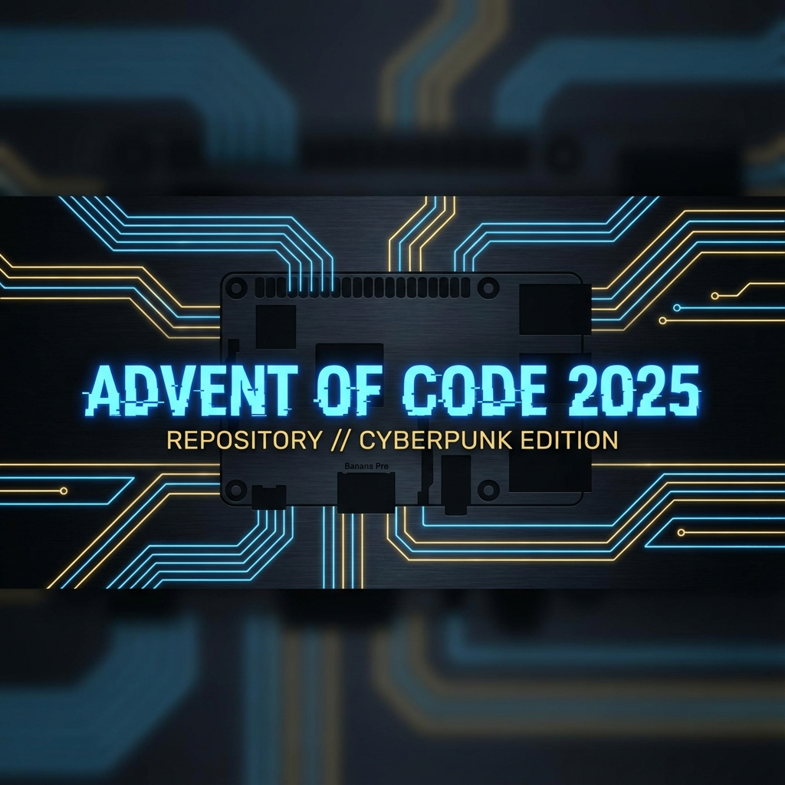

# 🎄 Advent of Code




[](LICENSE)


Welcome to my **Advent of Code** solutions repository!

This project maps my journey through the annual programming puzzles, focusing on **readability**, **clean algorithms**, and exploring language features in **Python** and **Rust**.

## 📖 Table of Contents
- [Quick Start](#-quick-start)
- [2025 Progress](#-2025-progress)
- [Past Years](#-past-years)
- [License](#-license)

## ⚡ Quick Start

For detailed setup instructions, please see [SETUP.md](SETUP.md).

**To check your environment:**
```bash
python check.py
```

---

## 🚀 2025 Progress

**Language**: Rust 🦀 & Python 🐍  
**Goal**: Optimized, idiomatic solutions.

| Day | Puzzle Name | Python | Rust |
| :-: | :--- | :-: | :-: |
| 01 | [Secret Entrance](https://adventofcode.com/2025/day/1) | [🐍 Solution](2025/days/day01/solution.py) <br> P1: ⚡ 566µs<br> P2: ⚡ 749µs | [🦀 Solution](2025/days/day01/src/lib.rs) <br> P1: ⚡ 48µs<br> P2: ⚡ 44µs |
| 02 | [Gift Shop](https://adventofcode.com/2025/day/2) | [🐍 Solution](2025/days/day02/solution.py) <br> P1: ⚡ 266.70ms<br> P2: ⚡ 765.41ms<br> P3: ⚡ 473.79ms | [🦀 Solution](2025/days/day02/src/lib.rs) <br> P1: ⚡ 47.94ms<br> P2: ⚡ 75.19ms |
| 03 | [Lobby](https://adventofcode.com/2025/day/3) | [🐍 Solution](2025/days/day03/solution.py) <br> P1: ⚡ 2.12ms<br> P2: ⚡ 898µs | [🦀 Solution](2025/days/day03/src/lib.rs) <br> P1: ⚡ 55µs<br> P2: ⚡ 79µs |
| 04 | [Printing Department](https://adventofcode.com/2025/day/4) | [🐍 Solution](2025/days/day04/solution.py) <br> P1: ⚡ 9.17ms<br> P2: ⚡ 249.90ms | [🦀 Solution](2025/days/day04/src/lib.rs) <br> P1: ⚡ 1.30ms<br> P2: ⚡ 28.08ms |
| 05 | [Cafeteria](https://adventofcode.com/2025/day/5) | [🐍 Solution](2025/days/day05/solution.py) <br> P1: ⚡ 587µs<br> P2: ⚡ 109µs | [🦀 Solution](2025/days/day05/src/lib.rs) <br> P1: ⚡ 55µs<br> P2: ⚡ 32µs |
| 06 | [Trash Compactor](https://adventofcode.com/2025/day/6) | [🐍 Solution](2025/days/day06/solution.py) <br> P1: ⚡ 631µs<br> P2: ⚡ 979µs | [🦀 Solution](2025/days/day06/src/lib.rs) <br> P1: ⚡ 50µs<br> P2: ⚡ 126µs |
| 07 | [Laboratories](https://adventofcode.com/2025/day/7) | [🐍 Solution](2025/days/day07/solution.py) <br> P1: ⚡ 1.00ms<br> P2: ⚡ 1.57ms | [🦀 Solution](2025/days/day07/src/lib.rs) <br> P1: ⚡ 38µs<br> P2: ⚡ 35µs |
| 08 | [Playground](https://adventofcode.com/2025/day/8) | [🐍 Solution](2025/days/day08/solution.py) <br> P1: ⚡ 138.32ms<br> P2: ⚡ 146.06ms | [🦀 Solution](2025/days/day08/src/lib.rs) <br> P1: ⚡ 17.06ms<br> P2: ⚡ 20.34ms |
| 09 | [Movie Theater](https://adventofcode.com/2025/day/9) | [🐍 Solution](2025/days/day09/solution.py) <br> P1: ⚡ 13.14ms<br> P2: ⚡ 1.14s<br> P3: ⚡ 241.31ms | [🦀 Solution](2025/days/day09/src/lib.rs) <br> P1: ⚡ 88µs<br> P2: ⚡ 3.50ms |
| 10 | [Factory](https://adventofcode.com/2025/day/10) | [🐍 Solution](2025/days/day10/solution.py) <br> P1: ⚡ 6.23ms<br> P2: ⚡ 91.82ms | [🦀 Solution](2025/days/day10/src/lib.rs) <br> P1: ⚡ 1.46ms<br> P2: ⚡ 2.54ms |
| 11 | [Reactor](https://adventofcode.com/2025/day/11) | [🐍 Solution](2025/days/day11/solution.py) <br> P1: ⚡ 31µs<br> P2: ⚡ 530µs | [🦀 Solution](2025/days/day11/src/lib.rs) <br> P1: ⚡ 127µs<br> P2: ⚡ 274µs |
| 12 | [Christmas Tree Farm](https://adventofcode.com/2025/day/12) | [🐍 Solution](2025/days/day12/solution.py) <br> P1: ⚡ 1.25ms | [🦀 Solution](2025/days/day12/src/lib.rs) <br> P1: ⚡ 184µs |

<!-- benchmark-env --> _Measured 2026-09-26 on 13th Gen Intel(R) Core(TM) i9-13900K, Windows 10.0.29671. Python 3.11.9: median of 5 runs. rustc 1.91.1: Criterion estimate (`cargo bench --bench bench`). Reproduce with `cd 2025 && python update_benchmarks.py --all`._


## 🗂️ Past Years

I've been participating for several years. Check out the archives:

| Year | Language(s) | Highlights / Notes |
| :---: | :--- | :--- |
| **[2024](2024/)** | Python, Rust | |
| **[2023](2023/)** | Python, Rust | Rust for 6 of the days. |
| **[2022](2022/)** | Python, Rust | |
| **[2021](2021/)** | Python, Rust | First year trying Rust! |
| **[2020](2020/)** | Python | |
| **[2019](2019/)** | C++ | Day 20 in Python. |
| **[2018](2018/)** | Python, C++ | Days 1-2 in C++. |
| **[2017](2017/)** | Python | |
| **[2016](2016/)** | Python | |
| **[2015](2015/)** | Python | The one that started it all. |

---

## ⚖️ License

This project is released into the public domain under [The Unlicense](https://unlicense.org) - see the [LICENSE](LICENSE) file for details.
